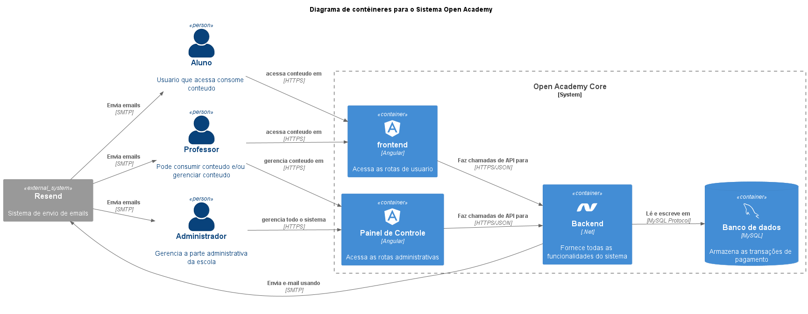

# OA_backend_core
Backend Core do Open Academy




## Como executar o projeto
Esse projeto depende de recursos que estão provisionados em containers docker.
Para executar o projeto, siga os passos abaixo:

Com o docker instalado na maquina execute o comando abaixo na raiz do projeto:
```
docker compose up
```

Esse arquivo não deve de maneira alguma ser usado em produção, ele é apenas para facilitar o desenvolvimento.
E para facilitar ele já conta com os dados de acesso pré-configurados.

## User Secrets 
Para evitar problemas no deploy o lint irá verificar se alguns dados estão hardcoded no projeto, para isso é necessário configurar o User Secrets no projeto.
```
 "AllowedHosts": "*",
  "AppConfig": {
    "ConnectionString": "server=localhost;port=3307;user=OA;password=123456!Oa;database=oa_local"
  }
```

A string acima é a padrão para a conexão com o docker.