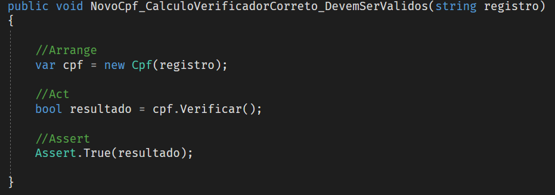
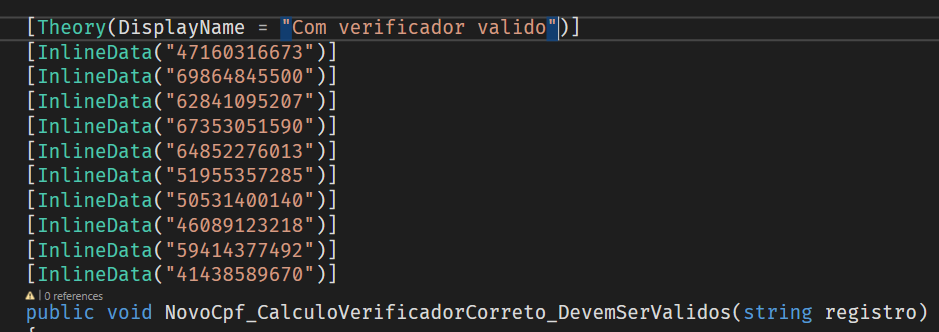

# Como Contribuir

## Comentários

Evitar o uso de comentários para explicar o que é obvio que o código faz.

Evitar deixar *tasks* no código, se for inevitável utilizar o padrão a seguir.

### Comentários TODO

Iniciar o comentário com a palavra “TODO” em maiúsculo, seguido de dois pontos, espaço e a descrição breve do que deve ser feita. Procure manter em uma frase curta, abrir uma *Issue* imediatamente, dando mais detalhes. Obs.: não utilizar “@” antes da palavra, seguir a risca o modelo.

```csharp
//TODO: Descrição breve do que precisa ser feito.
```

Caso você Resolva uma *issue* que envolva o TODO, favor remover o comentário também.

Os *Warnings* de “TODO” estão suprimidos no código, recomendo o uso das seguintes ferramentas para melhor visualizá-los:

[WarnAboutTODOs](https://marketplace.visualstudio.com/items?itemName=MattLaceyLtd.WarnAboutTODOs)

[SelectionTodoHighlighter](https://marketplace.visualstudio.com/items?itemName=ygoe.SelectionTodoHighlighter)


## Como contribuir com Testes

### Padronização de métodos de teste

NomeDoMetodo_Cenario_ResultadoEsperado()

NomeDaClasse_Cenario_ResultadoEsperado()


### Utilização dos comentários para definir limites de AAA

Arrange

Act

Assert



### Utilizar várias condições de testes

- Com [Theory]
- Com Autofixture + Bogus

